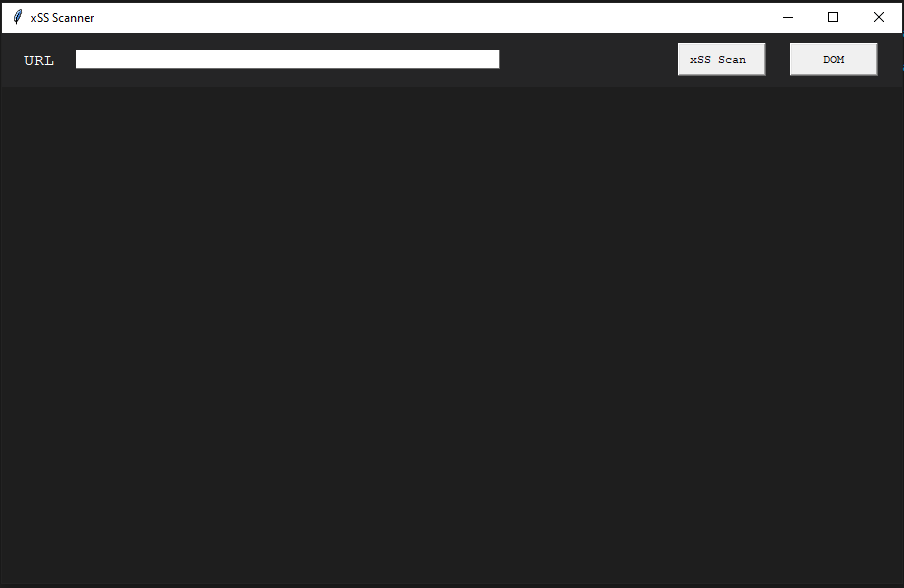
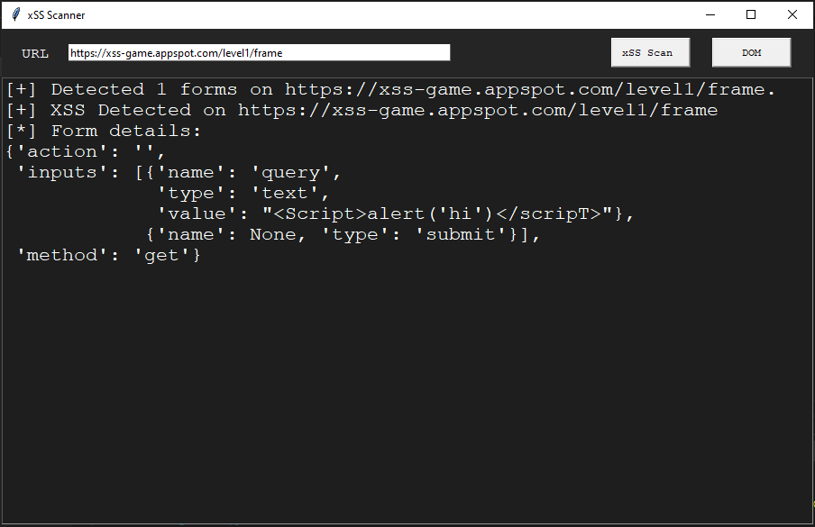
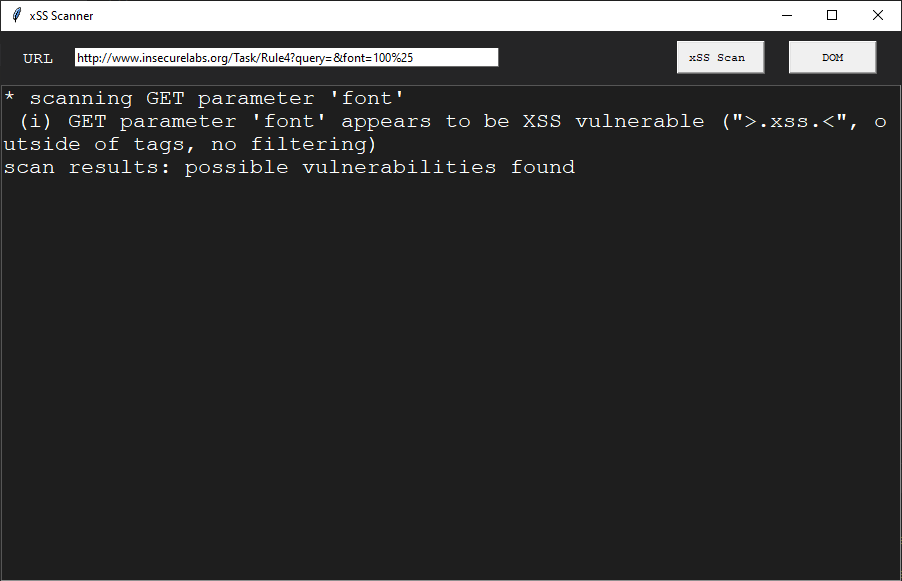

# xSS-Testing

# Table of contents

* [General info](#general-info)
* [Requirements](#requirements)
* [Additional Info](#additional-info)

# General info

This application was built in order to test XSS vulnerabilities within vulnerable web sites.  
Cross-site scripting works by manipulating a vulnerable web site so that it returns malicious JavaScript to users. When the malicious code executes inside a victim's browser, the attacker can fully compromise their interaction with the application.
 
 

# Requirements

The entire appliaction is built in Python and the tkinter module is used for the application's GUI .  For the script to function properly the libraries that need to be installed are :  pip3 install requests bs4. 
 
  

# Additional Info
<pre>
 The main function of the application is to:
 - grab all the HTML forms from a given URL and then print the number of forms detected.
 - iterate all over the forms and submit the forms with putting the value of all text and search input fields with a Javascript code.
 - if the Javscript code is injected and successfully executed then we come to the conclusion that 
 the web page is XSS vulnerable.

</pre>
 
# Testing results
 

  
 
 

  

 
 

  

